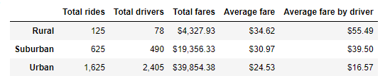

# PyBer_Analysis

## Overview

The purpose of this analysis is to bring some key insights to PyBer regarding their business. PyBer is a ridesharing app who is doing business in all kind of cities (rural, suburban and urban). 

## Results

From the data that we had to analyze, we can see that PyBer was used to make 2,375 rides. During that period of time, 2,973 drivers were working for the company. PyBer earned $63, 538.64 in fares. Each ride brought on average $26.75 to PyBer. We can also conclude that each driver brings on average $21.37 to the company for a ride. Of course, those results vary from a city type to the other. For more details, please take a look at the table below. 

## Summary
Here are three recommendations to PyBer to increase their revenues: 
1- There are too many drivers in the urban area. For that period of time, there were more drivers than rides made. This is problematic because your drivers don't have a single ride on average. You may want to let some of them go.
2- On the other hand, we may see that problem as the result of having not made enough rides during that time period. PyBer may  want to increase their publicity in urban areas so they can make more rides. 
3- PyBer could also specialize themselves on suburban and rural rides. The ratio fares by driver is excellent in comparison to the urban one. You want your drivers to bring in money and urban drivers are not as good as suburban and rural drivers to do so. 
